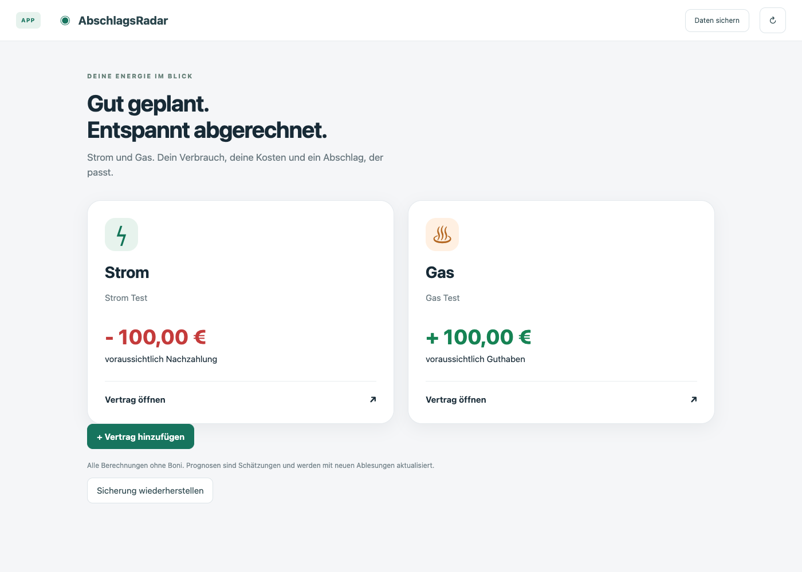
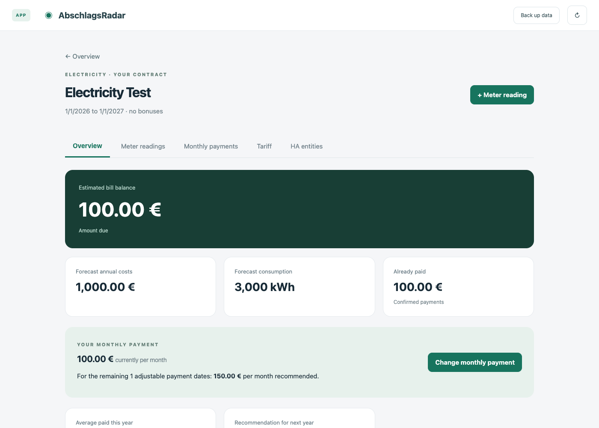
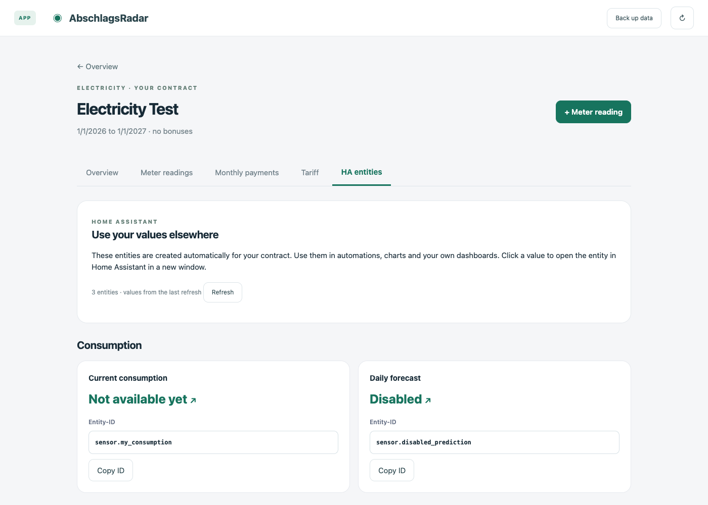
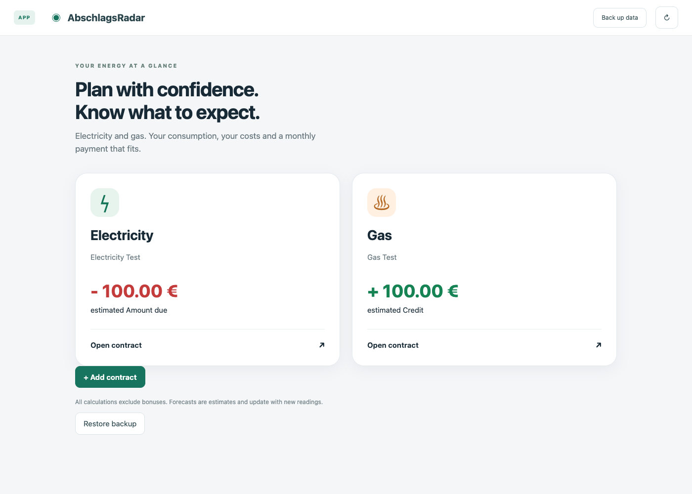
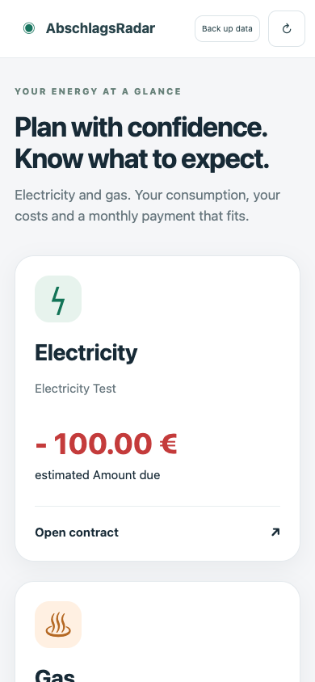

# AbschlagsRadar App · v0.4.6


**Reicht mein Abschlag für die nächste Strom- oder Gasabrechnung?**
AbschlagsRadar beantwortet diese Frage lokal in Home Assistant. Strom und Gas haben
eigene Bereiche mit Verbrauch, Kosten, Ablesungen, Tarifen und Abschlägen.
Die Startseite zeigt eine Nachzahlung rot mit Minus und ein Guthaben grün mit Plus.
Boni werden grundsätzlich ausgeschlossen. Die App ändert keine Zahlung beim Anbieter.

Für Nutzer gibt es **eine App-Installation**. Die App bringt ihre interne
Home-Assistant-Sensoranbindung und den lokalen Fotoscan als Beta-Funktion mit. Sie öffnet sich in der
Seitenleiste; ein zusätzliches Dashboard, HACS oder ein separates Passwort entfällt.
Experimentelle Version für AMD64. Die Hinweise zu Prognosen, Fotoscan (Beta) und Sicherungen unten beachten.

Die App übernimmt die Sprache des angemeldeten Home-Assistant-Nutzers. Deutsch und
Englisch sind enthalten; bei weiteren Sprachen verwendet die App englische Texte.
Zahlen und Datumswerte folgen der gewählten Region.

## Einblick

Alle Bilder zeigen erfundene Testverträge und enthalten keine privaten Vertragsdaten.







<details>
<summary>Weitere Ansichten</summary>





</details>

## Installieren

Zielsystem: **Home Assistant OS auf AMD64**. App-Funktionen und HA-Anbindung wurden mit HA 2026.9.4 geprüft. Andere
Architekturen werden erst nach zusätzlicher Validierung angeboten. HA Container/Core
ohne Supervisor kann diese App nicht installieren.

[](https://my.home-assistant.io/redirect/supervisor_addon_repository/?repository_url=https%3A%2F%2Fgithub.com%2FOrbitNestLab%2FAbschlagsRadar)

Über den Button die App-Quelle hinzufügen. Alternativ `https://github.com/OrbitNestLab/AbschlagsRadar`
unter **Einstellungen → Apps → App-Store → Repositories** ergänzen, dann
**AbschlagsRadar → Installieren → Starten → In Seitenleiste anzeigen**. Der erste Start
installiert die gebündelte Sensoranbindung. **Starte Home Assistant danach einmal manuell
neu**, bevor du Strom und Gas einrichtest. Die App startet Home Assistant weder nach einer
Installation noch nach einem Update automatisch neu. Wenn ein Update die interne
Sensoranbindung ändert, ist erneut ein manueller Neustart nötig.

Optional für bestehende SSH-/Docker-Installationen auf macOS: `Installieren.command` doppelklicken, HA-Adresse und SSH-Benutzer
eingeben und dem geführten Ablauf folgen. Der Starter benötigt die geprüfte
SSH-/Docker-Umgebung mit `sudo -n`. Er behält vorherige App-Quelldateien als
Rückfallkopie und verwendet für Versionswechsel den Supervisor-Updateweg.
Der vollständige Doppelklick-Ablauf auf einer fabrikneuen Instanz ist noch nicht geprüft.

Für die Installation wird das vorgebaute Image aus der öffentlichen Registry heruntergeladen; dazu ist Internet erforderlich. Bei der späteren Nutzung werden keine
Fotos oder Vertragsdaten an einen Clouddienst übertragen. Im Repository und
Installationspaket sind keine persönlichen Daten, Passwörter oder Tokens enthalten.

**Testgrenze:** Die dauerhafte Testumgebung läuft mit HA Container. Der vollständige App-Store-Erstinstallationsweg, Supervisor-Updates und eine vollständige HA-OS-Sicherungswiederherstellung sind noch nicht separat nachgewiesen. Der Fotoscan ist eine Beta-Funktion und wurde mit synthetischen Anzeigen geprüft; reale Zählerfotos können falsche Werte liefern und müssen immer kontrolliert werden.

Die Gestaltung bleibt beim Wechsel zwischen Reitern geladen; auch beim ersten
Öffnen werden Vertragsinhalte erst mit dem fertigen Layout angezeigt.

## Einrichten und bedienen

Die Formulare in der App verwenden **Arbeitspreise in Cent/kWh**, Grundpreise und
Abschläge in **Euro**. Intern und in JSON-Historien ist der Arbeitspreis **EUR/kWh**.
Alle Preise sind brutto. Der Grundpreis kann monatlich oder jährlich gelten.

Ein Vertrag umfasst ein Jahr ab dem Abrechnungsbeginn. Ein Beginn am 29. Februar
endet am 28. Februar des Folgejahres. Der monatliche Abschlagstag ist unabhängig
vom Abrechnungsbeginn und liegt zwischen 1 und 28. Nach der Jahresabrechnung den
Beginn ausdrücklich auf die neue Periode setzen; die App wechselt ihn nicht still.

- **Überblick:** Abrechnungsprognose, Verbrauch, Kosten, Abschlag und Vergleich.
- **Zählerstände:** manuelle Ablesungen, Fotoscan (Beta), automatische Ablesungen und direkte kWh-Intervalle.
- **Abschläge:** Änderungen mit Gültigkeitsdatum, tatsächliche Zahlungen und Empfehlungen.
- **Tarif:** datierte Preisänderungen, Gasnutzung, Faktor, Zählersensor und Vertragsdaten.

Änderungen, Fotoscan (Beta), Export und Wiederherstellung sind HA-Administratoren vorbehalten.
Alle Eingaben werden vor dem Speichern geprüft. Eine Ablesung am gleichen Datum
ersetzt den manuellen Stand. Eine Tarif- oder Abschlagsänderung am gleichen
Gültigkeitsdatum ersetzt die vorherige Änderung; separate Zahlungen dürfen sich addieren.

### Gas

Gaszähler können **m³ oder kWh** liefern. Nur bei m³ wird ein Faktor angewendet.
Verwende Brennwert × Zustandszahl aus deiner Rechnung. Eine spätere Faktorkorrektur
wirkt auf die gesamte Zählerhistorie; bei wechselnden historischen Faktoren direkte
kWh-Verbrauchsintervalle verwenden. Ein vorläufiger Faktor ist keine Rechnungsprüfung.

Die drei Nutzungsmodi sind nur Heizung, Heizung + Warmwasser und gleichmäßiger
Verbrauch. Die anfängliche Heizkurve hat höhere Winteranteile; Heizung + Warmwasser
verwendet 80 % Heizkurve und 20 % gleichmäßige Grundlast. Persönliche Historie kann
die Monatsverteilung anschließend bis zu 75 % bestimmen. Wetterbereinigung oder
Heizgradtage sind bisher nicht enthalten.

### Fotoscan (Beta)

**Zählerstände → Foto auslesen · Beta → Datum und JPEG/PNG auswählen.** Bei Bedarf den
Bildausschnitt in Prozent eingrenzen. Maximal 12 MB und 20 Megapixel; HEIC vorher
umwandeln. RapidOCR und seine Modelle laufen im App-Container. ONNX-Telemetrie wird
deaktiviert. Bilddaten bleiben im Arbeitsspeicher und werden nach Verarbeitung verworfen.

Diese Beta-Funktion kann falsche Ziffern erkennen. Der erkannte Stand wird **erst nach
deiner Bestätigung** gespeichert. Prüfe
Zählernummer, Nachkommastellen und Bezugsregister (bei Strom meist 1.8.0). Ein hoher
Erkennungswert beweist nicht, dass die richtige Zahl ausgewählt wurde. Reflexionen,
rote Stellen und mechanische Rollenzähler können Korrekturen erfordern. Ein fehlender
Dezimaltrenner wird nicht geraten. Es gibt keinen zusätzlichen OCR-Hilfsdienst.

### Zahlungen und Abschlagsempfehlungen

Datierte Abschlagsänderungen gelten ab dem gewählten Datum für folgende Fälligkeiten.
Der anfängliche Abschlag ist die Basis; laufende Änderungen in **Abschläge** erfassen.
Es wird grundsätzlich ein monatlicher Termin angenommen. Elf Abschläge oder
beliebige Sonderfälligkeiten sind noch kein eigener Zahlungsplan.

Ohne tatsächliche Zahlungen nimmt die App den bisherigen Zahlungsplan als bezahlt an
und kennzeichnet dies mit `payments_assumed`. Sobald eine tatsächliche Zahlung
eingetragen wurde, ersetzen die tatsächlichen Einträge den gesamten Zahlungsnachweis
der Periode: **Dann alle bisherigen Zahlungen erfassen.** Heute bestätigte Zahlungen
zählen bereits als bezahlt. Kosten/Verbrauch enden dagegen am letzten vollständigen Tag.

Erfasse nur tatsächlich bezahlte Beträge. Zusätzliche oder geteilte Zahlungen
werden vollständig summiert. Eine manuelle Vormerkung ist nicht mehr Teil der App.
Eine automatische Bankanbindung ist bisher nicht enthalten.

Der aktuell empfohlene Monatsabschlag ist:

`max(0, prognostizierte Periodenkosten − bezahlt) / verbleibende anpassbare Termine`

Die App zeigt die **konkreten verbleibenden Termine und das Periodenende**. Eine im
Januar beginnende Periode kann noch einen Termin im Januar des Folgejahres umfassen.
Der Vorschlag setzt einen gleichen Betrag an allen anpassbaren Terminen voraus;
der erwartete Saldo berücksichtigt stattdessen alle konfigurierten zukünftigen
Änderungen. Ohne Resttermin ist die Empfehlung offen, bei Überzahlung beträgt sie 0 Euro.

**Durchschnitt bezahlt dieses Jahr:** tatsächliche Zahlungen im Kalenderjahr, geteilt
durch die Zahl der Monate mit Zahlungen; Teilzahlungen eines Monats werden addiert.
Ohne Nachweis wird der angenommene Plan verwendet.

**Empfehlung nächstes Jahr:** prognostizierte Kosten des nächsten Kalenderjahres
geteilt durch zwölf. Sie verwendet die gelernte Verbrauchskurve und bekannte
datierte Tarife. Unbekannte Preisänderungen nach einer Preisgarantie kann sie nicht
vorhersagen. Boni sind immer ausgeschlossen.

## Datumsgenaue Historie

ISO (`2025-02-11`) und deutsche Daten (`11.02.2025`) sind zulässig; gespeichert wird
ISO. Direkte Intervalle enthalten immer kWh und sind **[Start, Ende)**. Sie ersetzen
die Zählerinterpolation für ihren Zeitraum und werden nicht zusätzlich addiert.
Zwischen zwei Zählerständen wird der Verbrauch gleichmäßig auf Tage verteilt.
Diese Aufteilung ist eine Annahme, keine tatsächliche tägliche Ablesung.

Die App bietet einzelne Formulare. Für vollständige Importe steht zusätzlich unter
**Geräte & Dienste → AbschlagsRadar → Konfigurieren → Historische Daten und Tarife**
eine JSON-Eingabe bereit. Sie ersetzt die manuelle Historie vollständig: vorher
exportieren. Automatische Ablesungen bleiben getrennt gespeichert. Beispiel:

```json
{
  "readings": [
    {"date": "11.02.2024", "value": 10000},
    {"date": "11.02.2025", "value": 13000}
  ],
  "intervals": [{"start": "11.02.2025", "end": "11.03.2025", "kwh": 250}],
  "tariffs": [{"date": "01.04.2025", "price": 0.28, "base": 144, "base_period": "yearly"}],
  "installments": [{"date": "01.07.2025", "amount": 120}],
  "payments": [{"date": "01.03.2025", "amount": 100}]
}
```

JSON-Zahlen verwenden einen Punkt als Dezimaltrenner. Jeder Tarif enthält Arbeits-
und Grundpreis. Änderungen gelten ab ihrem Datum; davor die Basis-Vertragswerte.
Grundpreise werden pro Kalendermonat/-jahr taggenau anteilig berechnet. Negative
Mengen, sinkende Stände, überlappende direkte Intervalle, doppelte Zählerdaten und
nicht endliche Zahlen werden abgelehnt. Maximal 10.000 Einträge je Liste und eine
Messdatenspanne von 100 Jahren verhindern unbeschränkte Rechenarbeit.

### Automatische Ablesungen und Zählerwechsel

Optional einen kumulativen HA-Sensor mit passender Einheit verbinden. Beim Start,
bei Änderungen und spätestens alle 15 Minuten wird geprüft. Der erste gültige Stand
eines Tages bleibt erhalten; manuelle Ablesungen haben am gleichen Datum Vorrang.
Die App zeigt automatische Werte aufklappbar und meldet fehlende oder widersprüchliche
Quelldaten. Die automatische Reihe liegt in `.storage/abschlagsradar.<entry_id>`.

Ein zurückspringender Zähler wird als möglicher Wechsel erkannt. Die alte Reihe in
direkte Intervalle umwandeln und eine neue Reihe beginnen; automatische Werte lassen
sich über die erweiterten HA-Einstellungen gezielt löschen. Die App summiert
verschiedene Zähler nicht stillschweigend zusammen.

## Prognose, native Sensoren und Diagramme

Aktuelle Messdaten bestimmen das Verbrauchsniveau. Vorjahresdaten liefern mit ihrer
Abdeckung zunehmend die saisonale Monatsverteilung. Fehlende Vorjahresmonate gelten
als unbekannt und werden mit der Grundkurve ergänzt. Bei ausreichenden aktuellen
Messdaten wird eine dauerhafte Verbrauchsänderung nicht durch ein altes Niveau
unterdrückt. Ohne aktuelle Messungen dienen Vorjahresdaten oder der konfigurierte
Jahresersatzwert als Basis. Dieses transparente Modell liefert **Schätzungen**;
aktuelle Ablesungen sind für eine belastbare Prognose wichtig.

Die bisherigen 24 nativen Sensoren je Vertrag behalten stabile IDs. Der frühere
Vormerkungssensor bleibt zur Kompatibilität erhalten, erscheint aber nicht in der App.
Ältere Sicherungen können weiterhin vorgemerkte Zahlungen enthalten: Diese Daten
bleiben erhalten und zählen weiterhin als feste geplante Zahlungen in der Berechnung.
Bei solchen Altbeständen reduziert sich die Restempfehlung entsprechend; sie werden
nicht automatisch als bezahlt markiert. Neue Verträge verwenden den oben beschriebenen
Zahlungsplan mit tatsächlichen Zahlungen.

Die sichtbaren Werte umfassen:

| Bereich | Werte |
| --- | --- |
| Bisher | Verbrauch, Kosten, bezahlt, Datenabdeckung |
| Prognose | Jahresverbrauch, Jahreskosten, Saldo, Nachzahlung, Guthaben |
| Abschlag | aktuell, empfohlen, Änderung, Resttermine, Jahressumme, Jahresdurchschnitt, nächstes Jahr |
| Vergleich | Vorjahresverbrauch, prozentuale Veränderung |
| Diagramm | Tagesverbrauch, Tagesverbrauch Vorjahr, Tagesprognose |
| Einordnung | Budgetstatus, Gewicht persönlicher Historie |

Positiver Sensor-Saldo bedeutet Nachzahlung, negativer Guthaben. Die Startseite
stellt dies aus Nutzersicht als rotes Minus bzw. grünes Plus dar. Innerhalb von ±1 EUR
ist der Budgetstatus ausgeglichen. Unvollständig abgedeckter Ist-Verbrauch und
Ist-Kosten bleiben `unknown`; die Prognose ergänzt Lücken. Datenabdeckung bezeichnet
die zeitliche Abdeckung durch Messintervalle, nicht Messgenauigkeit.

Normale HA-Verlaufskarten können numerische Sensoren ab Installation darstellen.
Ist-Summen verwenden `total` und den Periodenbeginn als `last_reset`. Prognosen haben
keine Verbrauchszähler-Statistikklasse und sind keine Einspeisung ins Energie-Dashboard.
Historische Importe werden nicht rückwirkend in Recorder geschrieben. Die Aktion
`abschlagsradar.get_daily_history` liefert `date`, `actual_kwh`, `previous_kwh` und
`forecast_kwh` für das ganze Abrechnungsjahr, ausgewählt mit `entry_id`. Die App nutzt
diese täglichen Werte für ihre Diagramme. Eine eigene Lovelace-Card kann später folgen.

## Sichern und wiederherstellen

**Daten sichern** exportiert Einstellungen, vollständige manuelle Historie und automatische
Ablesungen als JSON. **Sicherung wiederherstellen** prüft die Datei und bietet zwei Wege:

- **Neue Verträge anlegen**: alle oder einen ausgewählten Vertrag zurückholen – auch in
  einer leeren App, ohne vorher leere Strom-/Gasverträge anzulegen. Vorhandene Verträge
  bleiben erhalten. Die neu angelegten Verträge erhalten neue Sensor-IDs; bestehende
  Automationen nach einem vollständigen Löschen anhand des Reiters **HA-Entitäten** prüfen.
- **Vorhandenen Vertrag ersetzen**: Ziel derselben Energieart auswählen und ausdrücklich
  ersetzen. Seine Vertrags- und Sensor-IDs bleiben erhalten. Vorher den aktuellen Stand
  als Datei sichern.

Automatische Sicherungswerte werden mit manuellen zusammengeführt; manuelle Werte am
selben Datum haben Vorrang. Einstellungen, datumsgenaue Tarife, Abschlagsänderungen,
Zahlungen und Intervalle werden ebenfalls wiederhergestellt. Ein fehlgeschlagener Import
neuer Verträge entfernt die durch diesen Import angelegten Verträge wieder. Falls Home
Assistant die Bereinigung nicht ausführen kann, weist die App auf die Teilwiederherstellung
hin. Vorherige Daten werden zusätzlich lokal als Snapshot bewahrt.

Vollständige HA-Backups müssen **HA-Konfiguration und App** enthalten: maßgebliche
Vertragsdaten liegen in HA, App-Snapshots in `/data/radar.sqlite3`.
Die App hält höchstens 24 Datenstände und drei frühere Sensoranbindungs-Versionen.
Snapshots werden bei HA-Ausfällen nicht als aktuelle Prognose ausgegeben.

## Entwicklung

```sh
python3.12 -m pip install -r requirements-dev.txt
python3.12 tools/sync_sources.py --check
python3.12 tools/validate_release.py
python3.12 -m pytest tests -q
ruff check .
ruff format --check .
node --test tests/frontend.test.cjs
pnpm install --frozen-lockfile
pnpm exec playwright install chromium
pnpm test:browser
bash -n Installieren.command
```

Python 3.12 für App/OCR-Tests, Node 24 und pnpm 11.19.0 für Frontend-Prüfungen. HA selbst benötigt
keine OCR-Pakete. `custom_components/abschlagsradar` ist die kanonische Quelle der
internen Sensoranbindung; `tools/sync_sources.py` synchronisiert die App-Kopien.
Tests mit einer echten Inferenz dürfen in CI nicht übersprungen werden. Die CI baut
das AMD64-Image und prüft bekannte Paket-Sicherheitsmeldungen, veröffentlicht aber nichts.

[VALIDATION.md](VALIDATION.md) dokumentiert ausgeführte Prüfungen und Grenzen.
[PUBLISHING.md](PUBLISHING.md) beschreibt die noch nötigen öffentlichen Metadaten.
Lizenz: MIT; eingebundene Bibliotheken behalten ihre eigenen Lizenzen. Die geprüften
Abhängigkeiten sind vollständig versioniert. Name/Markenverfügbarkeit ist noch nicht geprüft.

## English quick start

Install the **AbschlagsRadar App** through a Home Assistant App repository on AMD64
HA OS and open it from the sidebar. The App installs its bundled sensor bridge; restart
Home Assistant manually afterwards. The App never restarts Home Assistant automatically.
Local photo OCR is a beta feature, and every detected reading must be checked. Electricity and gas have separate setup forms and
24 native sensors per contract. Review every scanned reading. Backups include
automatic samples and can be restored to an existing contract of the same energy
type. No bonuses or automatic supplier payment changes are included.

## Referenzen

[HA App-Konfiguration](https://developers.home-assistant.io/docs/apps/configuration/),
[HA App-Präsentation](https://developers.home-assistant.io/docs/apps/presentation/),
[Ingress/Sicherheit](https://developers.home-assistant.io/docs/apps/security/),
[Config Flow](https://developers.home-assistant.io/docs/core/integration/config_flow/),
[Sensoren](https://developers.home-assistant.io/docs/core/entity/sensor/),
[RapidOCR](https://github.com/RapidAI/RapidOCR/tree/v1.4.4),
[pip-audit](https://github.com/pypa/pip-audit),
[offizielles Python-Containerimage](https://hub.docker.com/_/python).

## HA-Entitäten in der App

Jeder Vertrag besitzt den Reiter **HA-Entitäten**. Dort stehen die automatisch erzeugten
Sensoren in Gruppen für Verbrauch, Kosten, Abschläge und Vergleich. Der angezeigte Wert
stammt aus Home Assistant; fehlende oder deaktivierte Werte werden ausdrücklich gekennzeichnet.
**ID kopieren** übernimmt die tatsächlich registrierte Entity-ID, auch nach einer Umbenennung.
Wenn der Browser keinen Zugriff auf die Zwischenablage erlaubt, wird die ID zum manuellen
Kopieren markiert. Ein Klick auf den Wert öffnet die Home-Assistant-Entitätsansicht in einem
neuen Fenster. **Aktualisieren** liest den aktuellen Stand erneut.

Die Entitäten können in Automationen, eigenen Dashboards und Diagrammkarten verwendet
werden. Historische Tageswerte bleiben zusätzlich über die dokumentierte Aktion verfügbar.
Der ältere Vormerkungssensor bleibt intern für bestehende Automationen erhalten; seine
entfernte Funktion wird nicht erneut in der App angezeigt.
